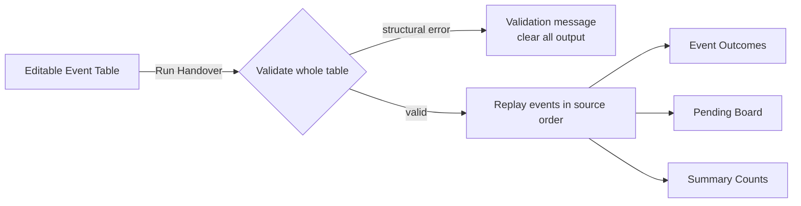
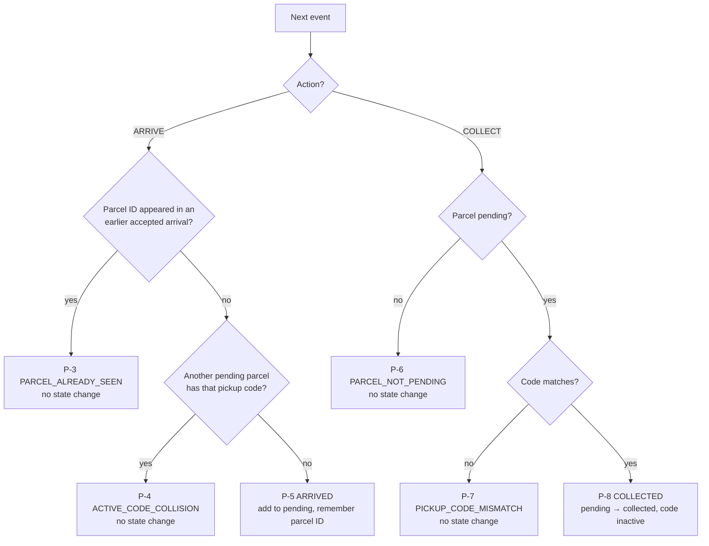
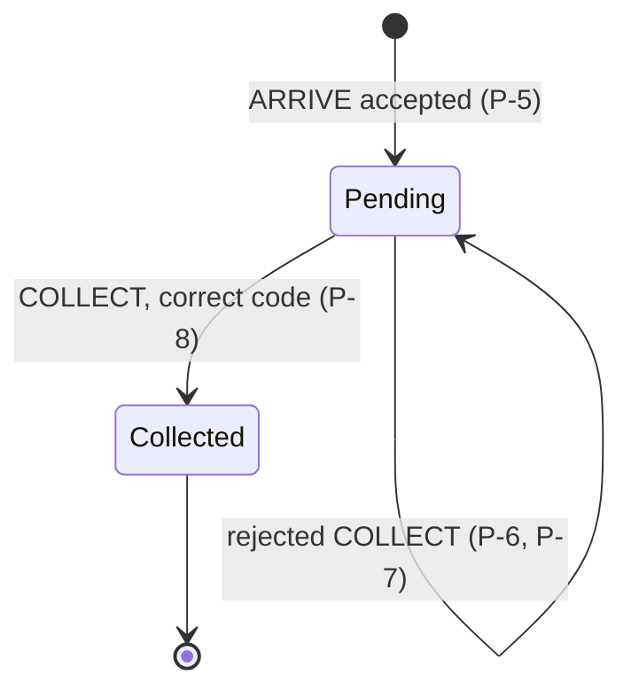

# Hostel Parcel-Desk Handover Board — Baseline Specification

> **STATUS: FROZEN — v1.0 (2026-08-22)**
> Every statement below is derived **only** from `context/Student_SI26_P11-hostel-parcel-desk-handover-board.docx`.
> This file is the immutable source of truth. Do **not** edit it to record design decisions,
> assumptions, or interpretations — those belong in [clarifications.md](clarifications.md),
> which traces back to the requirement IDs defined here.

---

## 1. The Problem

A hostel front desk is staffed by rotating volunteers. Parcels **arrive** (stored on a shelf with a pickup code) and are later **collected** by students who quote that code.

When a shift ends, the outgoing volunteer must hand over an exact picture of what is still sitting on the shelves.

Build a single screen that takes an **ordered event log**, replays it, and shows the outcome of every event, the final pending parcels, summary counts, and a validation message.

### Scope

| ID | Requirement |
|----|-------------|
| **SC-1** | The ordered event log is the **source of truth**. |
| **SC-2** | One attractive primary screen or report. |
| **SC-3** | Out of scope: authentication, notifications, delivery routing, bookings, backend, network service. |
| **SC-4** | Any medium is allowed: in-memory structures, spreadsheet, notebook, browser, desktop, mobile, or CLI producing a clear visual/tabular report. |

---

## 2. Built-in Sample Log `BL-1`

| Event | Action  | Parcel | Student | Code | Shelf | → Outcome |
|-------|---------|--------|---------|------|-------|-----------|
| E01   | ARRIVE  | P01    | Asha    | K7M2 | A1    | ARRIVED |
| E02   | ARRIVE  | P02    | Bilal   | R4Q8 | B1    | ARRIVED |
| E03   | COLLECT | P01    | —       | ZZZZ | —     | PICKUP_CODE_MISMATCH |
| E04   | ARRIVE  | P03    | Chen    | T9C4 | A2    | ARRIVED |
| E05   | COLLECT | P02    | —       | R4Q8 | —     | COLLECTED |
| E06   | ARRIVE  | P04    | Divya   | H2N6 | B2    | ARRIVED |

`BL-2` **Final handover:** pending `P01@A1`, `P03@A2`, `P04@B2` — in that order. Collected: `P02`.
`BL-3` **Summary:** 3 pending · 1 collected · 1 rejected.

---

## 3. Validation Contracts `V-*`

Validation runs over the **complete** event table **before** any processing.

| ID | Rule | Error |
|----|------|-------|
| **V-1** | Trim event ID, parcel ID, pickup code, student name, shelf label | — |
| **V-2** | Event ID must be non-empty | `INVALID_EVENT` |
| **V-3** | Parcel ID must be non-empty | `INVALID_EVENT` |
| **V-4** | Event IDs must be unique | `DUPLICATE_EVENT_ID` |
| **V-5** | Action is exactly `ARRIVE` or `COLLECT` | `INVALID_EVENT` |
| **V-6** | Pickup code contains exactly four uppercase letters or digits | `INVALID_PICKUP_CODE` |
| **V-7** | `ARRIVE` requires non-empty student, pickup code, and shelf | `INVALID_EVENT` |
| **V-8** | `COLLECT` requires a pickup code; its student and shelf are unused and may be blank | `INVALID_EVENT` |
| **V-9** | Errors are reported **with the event and field**, as applicable | — |
| **V-10** | A structural error produces **no** event outcomes and **no** summary, and clears output from an earlier run | — |
| **V-11** | An empty event table is **valid** → zero counts, no handover rows | — |

---

## 4. Processing Rules `P-*`

| ID | Rule |
|----|------|
| **P-1** | Every run starts with empty pending, collected, and seen-parcel state |
| **P-2** | Events process in **source order**; event IDs are labels and never determine processing order |

| ID | Rule |
|----|------|
| **P-3** | `ARRIVE` → `PARCEL_ALREADY_SEEN`, no state change, if the parcel ID appeared in an earlier **accepted** arrival |
| **P-4** | Else `ARRIVE` → `ACTIVE_CODE_COLLISION`, no state change, if another **pending** parcel has that pickup code |
| **P-5** | Else `ARRIVE` → `ARRIVED`: add to pending, remember the parcel ID |
| **P-6** | `COLLECT` → `PARCEL_NOT_PENDING`, no state change, when the parcel is not pending |
| **P-7** | `COLLECT` on a pending parcel with a differing code → `PICKUP_CODE_MISMATCH`, no state change |
| **P-8** | `COLLECT` with the correct code → remove from pending, add to collected, **make its code inactive**, report `COLLECTED` |
| **P-9** | State-dependent rejections are **event outcomes, not structural input errors** — later events continue to run |
| **P-10** | Rejected-action count = `PARCEL_ALREADY_SEEN` + `ACTIVE_CODE_COLLISION` + `PARCEL_NOT_PENDING` + `PICKUP_CODE_MISMATCH` |

### Parcel lifecycle

### Ordering `O-*`

| ID | Rule |
|----|------|
| **O-1** | Event outcomes preserve **source order** |
| **O-2** | Final pending parcels list by **accepted-arrival order** |
| **O-3** | Collected parcels list by **successful-collection order** |

---

## 5. UI Specification `U-*`

| ID | Element | Behaviour |
|----|---------|-----------|
| **U-1** | Event table | Editable |
| **U-2** | **Run Handover** action | Validates, then replays the whole log |
| **U-3** | Event outcomes | One per event |
| **U-4** | Final pending-parcel board | The handover state |
| **U-5** | Summary counts | pending / collected / rejected |
| **U-6** | Validation message | Error code with event and field |
| **U-7** | Sample / **Reset** controls | Reset restores the six valid built-in events and clears validation, outcomes, handover rows, and counts until Run Handover is used again |
| **U-8** | Synchronization | Event table, outcomes, pending and collected state, counts, validation message, and sample/reset actions stay synchronized |
| **U-9** | *Optional* | A compact shelf map driven by the final pending state, **without creating a second parcel store** |

---

## 6. Acceptance Criteria `AC-*`

| ID | Scenario | Expected |
|----|----------|----------|
| **AC-1** | Load and run the built-in log in **one action** | The 6 exact outcomes; pending order `P01, P03, P04`; **3 / 1 / 1** |
| **AC-2** | Change **only** E03's pickup code to `K7M2` | E03 = `COLLECTED`; pending `P03, P04`; **2 / 2 / 0** |
| **AC-3** | Reset, then change **only** E06's pickup code to `T9C4` | E06 = `ACTIVE_CODE_COLLISION`; P04 omitted from final state; **2 / 1 / 2** |
| **AC-4** | Clear the event table | Valid empty handover; **0 / 0 / 0**; no stale rows |
| **AC-5** | Reset, change E06's event ID to `E05` | `DUPLICATE_EVENT_ID`; no partial outcomes, handover rows, or summary counts |
| **AC-6** | Focused checks required | Built-in result, corrected code, active-code collision, empty log, duplicate event ID, source-order processing |

---

## 7. Process Requirements `PR-*`

| ID | Requirement |
|----|-------------|
| **PR-1** | Use AI coding assistants |
| **PR-2** | Before implementation, create a short plan of 3–5 ordered steps with useful checkpoints |
| **PR-3** | Be prepared to present the plan, explain changes to it, share relevant prompts, summarize the design, and show test evidence |
